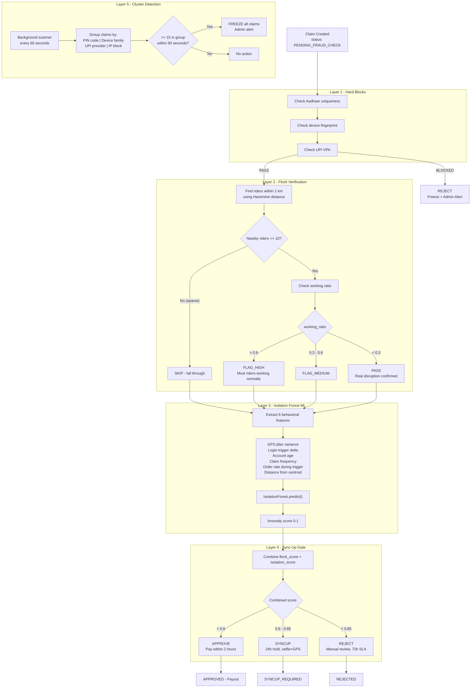

# InSureRide Backend

**Auth + Onboarding + Fraud Detection + Chatbot + Security**

AI-powered parametric income insurance for India's food-delivery riders. This module handles authentication, rider onboarding, 5-layer fraud detection, multilingual chatbot, and platform security.

---

## Quick Start

```bash
# Install dependencies
pip install -r requirements.txt

# Run the server
set PYTHONIOENCODING=utf-8          # Windows
uvicorn main:app --reload --port 8000

# Swagger UI
# Open http://localhost:8000/docs

# Run unit tests (8 tests)
pytest tests/test_fraud.py -v

# Run integration tests (14 tests)
python tests/test_endpoints.py
```

---

## API Endpoints

### Auth
```bash
# Request OTP
curl -X POST http://localhost:8000/auth/request-otp \
  -H "Content-Type: application/json" \
  -d '{"phone": "+919876543210"}'
# → {"request_id": "abc123...", "message": "OTP sent successfully"}

# Verify OTP (any 6 digits in demo mode)
curl -X POST http://localhost:8000/auth/verify-otp \
  -H "Content-Type: application/json" \
  -d '{"request_id": "abc123...", "otp": "123456"}'
# → {"access_token": "eyJ...", "refresh_token": "eyJ...", "rider_id": 1}

# Refresh Token
curl -X POST http://localhost:8000/auth/refresh \
  -H "Content-Type: application/json" \
  -d '{"refresh_token": "eyJ..."}'
# → {"access_token": "eyJ...", "token_type": "bearer"}
```

### Onboarding
```bash
# Link Platform
curl -X POST "http://localhost:8000/onboarding/link-platform?rider_id=1" \
  -H "Content-Type: application/json" \
  -d '{"platform": "swiggy", "rider_id": "SW00104729"}'
# → {"linked": true, "platform": "swiggy", "rider_id": "SW00104729"}

# Get Rider Stats
curl http://localhost:8000/onboarding/rider-stats/swiggy/SW00104729
# → {"star_rating": 4.0, "weeks_on_platform": 78, "avg_weekly_hours": 37.0, ...}

# Set Zone
curl -X POST "http://localhost:8000/onboarding/set-zone?rider_id=1" \
  -H "Content-Type: application/json" \
  -d '{"lat": 12.9249, "lng": 80.1000}'
# → {"zone_name": "Tambaram, Chennai", "lat": 12.9249, "lng": 80.1}

# Link UPI
curl -X POST "http://localhost:8000/onboarding/link-upi?rider_id=1" \
  -H "Content-Type: application/json" \
  -d '{"vpa": "ravi.kumar@phonepe"}'
# → {"verified": true, "vpa": "ravi.kumar@phonepe"}
```

### Fraud Detection
```bash
# Score a claim through all 5 layers
curl -X POST http://localhost:8000/fraud/score \
  -H "Content-Type: application/json" \
  -d '{"claim_id": 1}'
# → {"claim_id": 1, "score": 0.3011, "decision": "APPROVED", "flags": [...]}

# Get cluster alerts
curl http://localhost:8000/fraud/clusters
# → [{"cluster_id": "CLU-...", "size": 23, "grouping_key": "pin_code:400069", ...}]

# Sync-up verification
curl -X POST http://localhost:8000/claims/1/syncup \
  -H "Content-Type: application/json" \
  -d '{"selfie_b64": "base64data...", "gps_lat": 12.9249, "gps_lng": 80.1000}'
# → {"claim_id": 1, "new_score": 0.15, "decision": "APPROVED", "message": "..."}
```

### Chatbot
```bash
# English
curl -X POST http://localhost:8000/chat \
  -H "Content-Type: application/json" \
  -d '{"rider_id": 1, "message": "What is my claim status?", "lang": "en"}'
# → {"reply": "Let me check your latest claim status...", "intent": "claim_status", "suggested_actions": ["View claim details", "Contact support"]}

# Tamil
curl -X POST http://localhost:8000/chat \
  -H "Content-Type: application/json" \
  -d '{"rider_id": 1, "message": "vanakkam", "lang": "ta"}'
# → {"reply": "வணக்கம்! InSureRide-க்கு வரவேற்கிறோம்...", "intent": "greeting", ...}
```

---

## Fraud Detection Architecture

The showcase module: a **5-layer sequential fraud pipeline** that every claim passes through before payout.

### Architecture Diagram



### Layer Details

| Layer | File | Technique | What It Catches |
|-------|------|-----------|-----------------|
| **L1** | `layer1_hardblocks.py` | DB UNIQUE constraints + check queries | Multi-account fraud (same Aadhaar/device/UPI) |
| **L2** | `layer2_flock.py` | Haversine spatial query + working-ratio | Fake disruption claims (others nearby are working fine) |
| **L3** | `layer3_isolation_forest.py` | scikit-learn `IsolationForest(contamination=0.05)` | Behavioral anomalies (GPS spoofing, suspiciously timed logins) |
| **L4** | `layer4_syncup.py` | Combined-score decision matrix | Borderline cases — verified via selfie+GPS liveness check |
| **L5** | `layer5_cluster.py` | Background 60s scanner, grouping by PIN/device/UPI/IP | Coordinated fraud rings submitting 15+ claims simultaneously |

### Scoring

Each layer contributes a weighted score to the final composite:

```
composite = (0.35 * flock_score) + (0.45 * isolation_score) + (0.20 * cluster_bonus)
```

| Composite Score | Decision | Action |
|----------------|----------|--------|
| < 0.6 | **APPROVED** | Pay first, ask questions later. UPI credit within 2 hours. |
| 0.6 - 0.85 | **SYNCUP_REQUIRED** | 24-hour hold. Push notification for selfie + GPS verification. |
| > 0.85 | **REJECTED** | Manual review. SMS in rider's language with appeal option. 72h SLA. |

### Key Insight: Flock Verification

> "Fraud rings can fake one rider's GPS, but they cannot fake the absence of 50 others who are visibly working."

When rider A claims a disruption stopped them from working, we check: **how many of the other insured riders within 1 km are also stopped?** If 76 out of 80 are stopped → real disruption → pay immediately. If 72 out of 80 are working normally → suspicious → sync-up required.

### Test Coverage

8 unit tests including:
- Hard block duplicate Aadhaar detection (DB-level + function-level)
- Flock PASS on real disruption (most riders stopped)
- Flock FLAG_HIGH on suspicious claim (most riders working)
- Isolation Forest: normal vs suspicious behavior scoring
- Decision matrix thresholds (approve/syncup/reject)
- **Synthetic fraud ring of 50 spoofed accounts** → detected and frozen
- Full orchestrator end-to-end: legitimate claim → APPROVED with score 0.30

---

## Security & OWASP Top 10 Mitigations

Every item from the OWASP Top 10 (2021) is explicitly addressed:

| # | OWASP Risk | Our Mitigation | Implementation |
|---|-----------|---------------|----------------|
| **A01** | **Broken Access Control** | JWT bearer tokens on all protected endpoints. Access tokens expire in 1 hour. Refresh tokens in 30 days. | `auth/jwt_service.py` |
| **A02** | **Cryptographic Failures** | Aadhaar numbers stored as SHA-256 hashes, never in plaintext. JWT signed with HS256 + configurable secret key. | `models.py`, `auth/jwt_service.py` |
| **A03** | **Injection** | All database queries use SQLAlchemy ORM with parameterized queries. Zero raw SQL in application code. | `db.py`, all route handlers |
| **A04** | **Insecure Design** | 5-layer fraud detection with spatial verification. Rate limiting on all endpoints. Audit logging on all critical operations. | `fraud_detection/`, `security/` |
| **A05** | **Security Misconfiguration** | CORS locked down to known frontend origins only. Debug mode disabled in production config. Environment variables for all secrets. | `security/cors_config.py`, `config.py` |
| **A06** | **Vulnerable Components** | All dependency versions pinned in `requirements.txt`. No known CVEs in used versions. | `requirements.txt` |
| **A07** | **Auth Failures** | OTP-based phone authentication. Rate limited to 10 req/min on auth endpoints to prevent brute force. OTP expires after 5 minutes. | `auth/otp_service.py`, `security/rate_limit.py` |
| **A08** | **Data Integrity Failures** | Audit log entries include SHA-256 hash of the action payload. All claim decisions logged with full fraud score breakdown. | `security/audit_log.py` |
| **A09** | **Logging Failures** | Comprehensive audit log table recording actor, action, timestamp, and payload hash for every critical operation (OTP, claim scoring, payout, config change). | `security/audit_log.py`, `models.py` |
| **A10** | **SSRF** | No user-controllable URL fetching. All external API calls (weather, platform status) go through server-side mocks with hardcoded endpoints. | `onboarding/platform_link.py` |

### Security Middleware Stack

```
Request → Rate Limiter (slowapi) → CORS Check → Pydantic Validation → Handler → Audit Log
```

| Layer | File | Config |
|-------|------|--------|
| **Rate Limiting** | `security/rate_limit.py` | 60 req/min general, 10 req/min on `/auth/*` |
| **CORS** | `security/cors_config.py` | Whitelisted origins only |
| **Input Validation** | `security/validation.py` | 18 Pydantic models, regex validators for phone/VPA/OTP |
| **Audit Logging** | `security/audit_log.py` | SHA-256 hashed payloads, `@audit` decorator |

### Device Fingerprinting

At onboarding, we capture and hash:
- User-Agent string
- Client-sent device ID
- First-seen IP address

This fingerprint is stored with UNIQUE constraint — one device = one policy. Any collision triggers a Layer 1 hard block.

---

## Multilingual Chatbot

### Supported Languages
| Code | Language | Script |
|------|----------|--------|
| `en` | English | Latin |
| `hi` | Hindi | Devanagari |
| `ta` | Tamil | Tamil |
| `te` | Telugu | Telugu |
| `kn` | Kannada | Kannada |
| `bn` | Bengali | Bengali |

### Supported Intents (10)
| Intent | Example Triggers (English) |
|--------|---------------------------|
| `greeting` | "hello", "hi", "hey" |
| `claim_status` | "my claim", "status", "where is my claim" |
| `payout_time` | "when payout", "how long", "money" |
| `why_rejected` | "rejected", "why", "denied" |
| `how_to_refer` | "refer", "friend", "share code" |
| `change_language` | "language", "switch", "hindi" |
| `file_manual_claim` | "report", "issue", "problem" |
| `cancel_policy` | "cancel", "stop", "unsubscribe" |
| `update_upi` | "upi", "change upi", "gpay" |
| `contact_human` | "human", "agent", "support" |

Total: **60 response templates** (10 intents x 6 languages) in `templates/chat/`.

---

## Demo Data

10 riders seeded across Indian cities on server startup:

| Rider | City | Platform | Trust Score | Tier |
|-------|------|----------|-------------|------|
| Ravi Kumar | Tambaram, Chennai | Swiggy | 847 | Gold |
| Arun M | Andheri, Mumbai | Zomato | 720 | Gold |
| Priya S | Koramangala, Bangalore | Swiggy | 920 | Platinum |
| Rajesh K | Madhapur, Hyderabad | Zepto | 580 | Silver |
| Sunil D | Connaught Place, Delhi | Blinkit | 420 | Silver |
| Meena R | T. Nagar, Chennai | Swiggy | 790 | Gold |
| Deepak P | Salt Lake, Kolkata | Dunzo | 710 | Gold |
| Vikram S | Kothrud, Pune | Zomato | 870 | Gold |
| Kavita N | Dwarka, Delhi | Amazon | 510 | Silver |
| Ganesh T | Velachery, Chennai | Swiggy | 350 | Bronze |

Plus: 7 cohorts, 3 trigger events, sample claims, referrals, and audit log entries.

---

## Project Structure

```
backend/
├── main.py                          # FastAPI entry point + lifespan
├── config.py                        # Environment config + demo defaults
├── db.py                            # SQLAlchemy + SQLite
├── models.py                        # Full ORM schema
├── seed_data.py                     # 10 demo riders + sample data
├── requirements.txt                 # Pinned dependencies
├── auth/
│   ├── otp_service.py               # In-memory OTP, 5-min TTL
│   ├── jwt_service.py               # HS256 access + refresh tokens
│   └── routes.py                    # 3 auth endpoints
├── onboarding/
│   ├── platform_link.py             # Platform linking + mock stats
│   ├── upi_link.py                  # UPI VPA validation
│   ├── device_fingerprint.py        # Device fingerprinting
│   ├── zone_set.py                  # Haversine zone detection (30 cities)
│   └── routes.py                    # 4 onboarding endpoints
├── fraud_detection/
│   ├── layer1_hardblocks.py         # Aadhaar/device/UPI uniqueness
│   ├── layer2_flock.py              # Flock Verification (spatial)
│   ├── layer3_isolation_forest.py   # Isolation Forest ML
│   ├── layer4_syncup.py             # Sync-up gate decision matrix
│   ├── layer5_cluster.py            # Cluster detection (background)
│   ├── score_orchestrator.py        # 5-layer scoring pipeline
│   └── routes.py                    # 3 fraud endpoints
├── chatbot/
│   ├── intent_matcher.py            # 10 intents x 6 languages
│   ├── response_loader.py           # Template loader + fallbacks
│   └── routes.py                    # POST /chat
├── security/
│   ├── validation.py                # 18 Pydantic models
│   ├── rate_limit.py                # slowapi middleware
│   ├── cors_config.py               # CORS lockdown
│   └── audit_log.py                 # SHA-256 audit logging
├── templates/chat/                  # 60 response templates (10x6)
└── tests/
    ├── test_fraud.py                # 8 unit tests
    └── test_endpoints.py            # 14 integration tests
```
